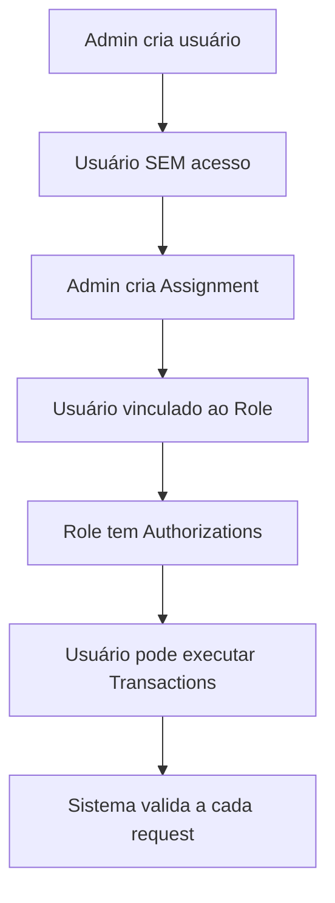

## Nós Iniciais (PONTOS PERMISSÕES)

### 1. **Endpoint Raiz**
- **Localização**: `app.startup:read_root`
- **Função**: Verificação básica de saúde da API
- **Resposta**: `{'message': 'Welcome to API!'}`

### 2. **Endpoints de Autenticação**
- **Router**: `app.api.authentication.router`
- **Função**: Ponto de entrada para obtenção de tokens JWT
- **Prefixo**: `/auth`

### 3. **Endpoints de Recursos Principais**
- **Usuários**: `app.api.user.router` - `/users`
- **Roles**: `app.api.role.router` - `/role`
- **Transações**: `app.api.transaction.router` - `/transaction`
- **Assignments**: `app.api.assignment.router` - `/assignment`
- **Autorizações**: `app.api.authorization.router` - `/authorization`
- **Processamento de Texto IA**: `app.api.text_processing.router` - `/text-processing`

## Nós de Decisão (Pontos de Ramificação)

### 1. **Middleware de Autorização**
- **Componente**: `AuthorizationMiddleware`
- **Função**: Intercepta todas as requisições e adiciona headers de tempo de processamento
- **Decisão**: Continua o fluxo para o próximo middleware/endpoint

### 2. **Validação de Acesso a Transações**
- **Função**: `validate_transaction_access`
- **Decisão**: Autoriza ou nega acesso baseado no sistema RBAC
- **Exceções**: 
  - `IllegalAccessException` - Acesso negado
  - `AmbiguousAuthorizationException` - Autorização ambígua

### 3. **Autenticação de Usuário**
- **Função**: `get_current_user`
- **Decisão**: Valida token JWT e retorna usuário atual ou falha na autenticação

## Nós Finais (Pontos de Saída)

### 1. **Respostas de Sucesso**
- **Schemas**: 
  - `SimpleMessageSchema` - Mensagens simples
  - Schemas específicos por entidade (User, Role, Transaction, etc.)

### 2. **Respostas de Erro**
- **HTTP 400**: `IntegrityValidationException`
- **HTTP 401**: `IllegalAccessException`, `AmbiguousAuthorizationException`
- **HTTP 404**: `ObjectNotFoundException`
- **HTTP 409**: `ObjectConflitException`

### 3. **Persistência de Dados**
- **Banco de Dados**: SQLite via database.db
- **Sessão**: `get_session`

## Agrupamentos Naturais

### 1. **Sistema de Autenticação e Autorização (RBAC)**
```
User ↔ Assignment ↔ Role ↔ Authorization ↔ Transaction
```
- **User**: `app.models.user.User`
- **Assignment**: `app.models.assignment.Assignment`
- **Role**: `app.models.role.Role`
- **Authorization**: `app.models.authorization.Authorization`
- **Transaction**: `app.models.transaction.Transaction`

### 2. **Sistema de Processamento de IA**
- **Controlador**: `TextProcessingController`
- **Modelo**: `ProcessedText`
- **Integração**: CrewAI + LangChain para processamento de texto

### 3. **Camada de Auditoria**
- **Base**: `AbstractBaseModel`
- **Campos**: `audit_user_ip`, `audit_user_login`, `audit_created_at`, `audit_updated_on`

### 4. **Sistema de Migrações**
- **Configuração**: alembic.ini
- **Migrações**: 
  - `00292430c7bd_bigbang.py` - Estrutura inicial
  - `6d421afaf99a_create_processed_data_table.py` - Tabela de dados processados

### 5. **Sistema de Seeds**
- **Dados Iniciais**: `seed_transactions.py`, `seed_super_user.py`
- **Códigos de Operação**: `EnumOperationCode`

### 6. **Camada de Testes**
- **Configuração**: `tests.conftest`
- **Factories**: Padrão Factory para criação de dados de teste
- **Cobertura**: Configurada via pytest-cov

Este sistema segue uma arquitetura em camadas com separação clara de responsabilidades, implementando um modelo RBAC robusto com auditoria completa e integração com IA para processamento de texto.

jvras58: COM BASE NISSO COMO UM USUARIO NOVO GANHA AS PERMISSÕES, COMO SE CRIA NOVAS PERMISSÕES E ETC?? 

GitHub Copilot: Vou analisar o sistema de permissões para explicar como funciona o processo de criação de usuários, atribuição de permissões e criação de novas permissões. Deixe-me examinar os componentes relevantes do sistema. 

5 tarefas pendentes criadas

Iniciando (1/5) *Analisar seeds de dados iniciais*

Leitura [](file:///workspace/seeds/seed_super_user.py#1-1), linhas 1 para 50

Leitura [](file:///workspace/seeds/seed_super_user.py#45-45), linhas 45 para 87

Leitura [](file:///workspace/seeds/seed_transactions.py#1-1), linhas 1 para 50

Iniciando (2/5) *Examinar controladores de usuário*

Texto pesquisado para `create` (`**/app/api/user/**/*.py`), 2 resultados

Leitura [](file:///workspace/app/api/user/router.py#30-30), linhas 30 para 60

Texto pesquisado para `create` (`**/app/api/assignment/**/*.py`), 3 resultados

Leitura [](file:///workspace/app/api/assignment/router.py#65-65), linhas 65 para 100

Iniciando (3/5) *Analisar sistema de Assignment*

Leia [](file:///workspace/app/api/assignment/schemas.py)

Texto pesquisado para `create` (`**/app/api/authorization/**/*.py`), 3 resultados

Leitura [](file:///workspace/app/api/authorization/router.py#35-35), linhas 35 para 70

Iniciando (4/5) *Examinar sistema de Authorization*

Leitura [](file:///workspace/app/api/authorization/controller.py#1-1), linhas 1 para 40

Leitura [](file:///workspace/app/api/authorization/controller.py#40-40), linhas 40 para 67

Leia [](file:///workspace/app/api/transaction/enum_operation_code.py)

Iniciando (5/5) *Documentar fluxo completo*

Com base na análise completa do sistema, aqui está o **fluxo completo de como um usuário novo ganha permissões e como se criam novas permissões**:

## 🚀 **COMO UM USUÁRIO NOVO GANHA PERMISSÕES**

### **1. Criação do Usuário**
```http
POST /users/
Content-Type: application/json

{
    "username": "novo_usuario",
    "display_name": "Nome do Usuário",
    "email": "usuario@empresa.com",
    "password": "senha123"
}
```

**⚠️ IMPORTANTE**: A criação de usuário **NÃO** atribui permissões automaticamente. O usuário fica **sem acesso** até receber um `Assignment`.

### **2. Atribuição de Role (Assignment)**
Para dar permissões ao usuário, você deve criar um **Assignment**:

```http
POST /assignment/
Authorization: Bearer <token_admin>
Content-Type: application/json

{
    "user_id": 123,
    "role_id": 2
}
```

**Quem pode fazer isso?** Apenas usuários com permissão `OP_1010001` (Assignment - Create).

### **3. Fluxo Completo de Permissões**

```
Usuario → Assignment → Role → Authorization → Transaction
   ↓          ↓        ↓         ↓             ↓
 João  →  vincula  → Admin  → autoriza  → Criar Usuário
```

## 🔧 **COMO CRIAR NOVAS PERMISSÕES**

### **1. Criar Nova Transaction (Operação)**
```http
POST /transaction/
Authorization: Bearer <token_admin>
Content-Type: application/json

{
    "name": "Relatório Financeiro - Gerar",
    "description": "Gerar relatórios financeiros mensais",
    "operation_code": "3000001"
}
```

### **2. Definir Código de Operação**
Primeiro, adicione o novo código no enum:

```python
# app/api/transaction/enum_operation_code.py
class EnumOperationCode(Enum):
    # ... códigos existentes ...
    
    # --------------------- Relatórios ---------------------
    OP_3000001 = '3000001'  # Relatório Financeiro - Gerar
    OP_3000002 = '3000002'  # Relatório Financeiro - Visualizar
```

### **3. Autorizar Role para a Nova Transaction**
```http
POST /authorization/
Authorization: Bearer <token_admin>
Content-Type: application/json

{
    "role_id": 2,
    "transaction_id": 456
}
```

### **4. Implementar Validação no Endpoint**
```python
@router.post('/relatorio-financeiro/')
def gerar_relatorio_financeiro(
    db_session: SessionDep,
    current_user: CurrentUser,
):
    # Validar se o usuário tem permissão
    validate_transaction_access(db_session, current_user, '3000001')
    
    # Lógica do relatório...
```

## 📋 **CENÁRIOS PRÁTICOS**

### **Cenário 1: Novo Funcionário**
```bash
# 1. Admin cria o usuário
curl -X POST /users/ -d '{"username":"maria", "email":"maria@empresa.com", ...}'

# 2. Admin atribui role "Operador"
curl -X POST /assignment/ -d '{"user_id":123, "role_id":3}'

# 3. Maria agora tem todas as permissões do role "Operador"
```

### **Cenário 2: Nova Funcionalidade**
```bash
# 1. Admin cria nova transaction
curl -X POST /transaction/ -d '{"name":"Backup - Executar", "operation_code":"4000001"}'

# 2. Admin autoriza role "TI" para essa operação
curl -X POST /authorization/ -d '{"role_id":4, "transaction_id":789}'

# 3. Todos os usuários com role "TI" agora podem executar backup
```

### **Cenário 3: Promoção de Usuário**
```bash
# 1. Admin remove assignment atual
curl -X DELETE /assignment/456

# 2. Admin cria novo assignment com role superior
curl -X POST /assignment/ -d '{"user_id":123, "role_id":1}'  # Role Admin
```

## 🔐 **SISTEMA DE VALIDAÇÃO**

A função `validate_transaction_access()` faz esta verificação:

```python
User → Assignment → Role → Authorization → Transaction
  ↓       (JOIN)    ↓      (JOIN)        ↓
João → tem role Admin → Admin pode → Criar Usuário (OP_1040001)
```

**Se qualquer link da cadeia estiver quebrado = ACESSO NEGADO**

## 🏗️ **ESTRUTURA HIERÁRQUICA SUGERIDA**

```
SUPER ADMIN (todas as permissões)
├── ADMIN (gerenciar usuários e roles)
├── GERENTE (operações de negócio)
├── OPERADOR (operações básicas)
└── VISITANTE (apenas leitura)
```

## ⚡ **COMANDOS RÁPIDOS**

```bash
# Inicializar sistema com super admin
python seeds/seed_super_user.py

# Criar todas as transactions padrão
python seeds/seed_transactions.py

# Ver permissões de um usuário
GET /users/123/transactions
```

**🎯 RESUMO**: O sistema usa RBAC (Role-Based Access Control) onde usuários recebem roles via `Assignment`, e roles têm permissões via `Authorization` para `Transactions` específicas. Cada endpoint valida se o usuário tem a transaction/permissão necessária antes de executar a operação. 

(5/5) concluídas *Documentar fluxo completo*

jvras58: @agent Tentar novamente

GitHub Copilot: 

jvras58: @agent Tentar novamente

GitHub Copilot: Vou analisar novamente o sistema de permissões de forma mais detalhada, examinando todos os componentes para fornecer uma explicação completa e precisa. 

4 tarefas pendentes criadas

Iniciando (1/4) *Analisar estrutura completa de permissões*

Pesquisado base de código para "user creation assignment role authorization permission system RBAC", 23 resultados

Leitura [](file:///workspace/app/api/user/router.py#1-1), linhas 1 para 100

Leitura [](file:///workspace/app/api/user/router.py#100-100), linhas 100 para 133

Iniciando (2/4) *Mapear fluxo de criação de usuários*

Ran terminal command: find /workspace -name "*.py" -path "*/api/transaction/*" | grep -E "(router|controller|schemas)" | head -10

Leitura [](file:///workspace/app/api/transaction/router.py#1-1), linhas 1 para 80

Leia [](file:///workspace/app/api/transaction/schemas.py)

Iniciando (3/4) *Documentar processo de criação de permissões*

Texto pesquisado para `validate_transaction_access`, 20 resultados

Iniciando (4/4) *Criar guia prático de gestão*

# 🔐 **SISTEMA DE PERMISSÕES - GUIA COMPLETO**

Baseado na análise detalhada do código, aqui está o **guia completo** de como funciona o sistema de permissões RBAC (Role-Based Access Control) e como gerenciar usuários e permissões:

## 🚀 **COMO UM USUÁRIO NOVO GANHA PERMISSÕES**

### **1. Criação do Usuário (SEM PERMISSÕES)**

```http
POST /users/
Content-Type: application/json

{
    "username": "novo_funcionario",
    "display_name": "João Silva", 
    "email": "joao@empresa.com",
    "password": "senha123"
}
```

**⚠️ IMPORTANTE**: Este endpoint **NÃO requer autenticação** e **NÃO atribui permissões**. O usuário fica completamente **sem acesso** ao sistema.

### **2. Atribuição de Role via Assignment**

Para dar permissões, um **administrador** deve criar um Assignment:

```http
POST /assignment/
Authorization: Bearer <token_admin>
Content-Type: application/json

{
    "user_id": 123,
    "role_id": 2
}
```

**Quem pode fazer?** Apenas usuários com permissão `OP_1010001` (Assignment - Create).

### **3. Cadeia de Permissões (RBAC)**

```
👤 User → 🔗 Assignment → 👥 Role → ✅ Authorization → 🔧 Transaction
   João   →   vincula   → Admin →   autoriza    → Criar Usuário
```

**Validação**: A função `validate_transaction_access()` verifica esta cadeia completa antes de permitir qualquer operação.

## 🆕 **COMO CRIAR NOVAS PERMISSÕES**

### **1. Definir Código de Operação**

Primeiro, adicione no enum de códigos:

```python
# app/api/transaction/enum_operation_code.py
class EnumOperationCode(Enum):
    # ... códigos existentes ...
    
    # --------------------- Nova Funcionalidade ---------------------
    OP_5000001 = '5000001'  # Relatórios - Gerar
    OP_5000002 = '5000002'  # Relatórios - Visualizar  
    OP_5000003 = '5000003'  # Relatórios - Excluir
```

### **2. Criar Nova Transaction**

```http
POST /transaction/
Authorization: Bearer <token_admin>
Content-Type: application/json

{
    "name": "Relatórios - Gerar",
    "description": "Gerar relatórios financeiros do sistema",
    "operation_code": "5000001"
}
```

**Quem pode fazer?** Apenas usuários com permissão `OP_1030001` (Transaction - Create).

### **3. Autorizar Roles para a Nova Transaction**

```http
POST /authorization/
Authorization: Bearer <token_admin>
Content-Type: application/json

{
    "role_id": 2,        # Role "Gerente"  
    "transaction_id": 456 # Transaction "Relatórios - Gerar"
}
```

**Quem pode fazer?** Apenas usuários com permissão `OP_1020001` (Authorization - Create).

### **4. Implementar Validação no Endpoint**

```python
@router.post('/relatorios/gerar')
def gerar_relatorio_financeiro(
    db_session: SessionDep,
    current_user: CurrentUser,
):
    # ✅ Validar permissão antes de executar
    validate_transaction_access(db_session, current_user, '5000001')
    
    # 🔧 Lógica do relatório aqui...
    return {"message": "Relatório gerado com sucesso"}
```

## 📊 **ESTRUTURA HIERÁRQUICA TÍPICA**

```
🔥 SUPER ADMIN (todas as permissões)
├── 👨‍💼 ADMIN (gerenciar usuários, roles, autorizações)  
├── 📈 GERENTE (operações de negócio, relatórios)
├── ⚙️ OPERADOR (operações básicas do dia-a-dia)
└── 👁️ VISITANTE (apenas consultas/leitura)
```

## 🔍 **CONSULTAR PERMISSÕES DE UM USUÁRIO**

```http
GET /users/{user_id}/transactions
Authorization: Bearer <token_admin>
```

**Quem pode fazer?** Apenas usuários com permissão `OP_1040006` (User - Transactions granted).

**Retorna**: Lista de todas as transactions/operações que o usuário pode executar.

## 📋 **CENÁRIOS PRÁTICOS COMPLETOS**

### **Cenário 1: Novo Funcionário (Operador)**

```bash
# 1. Admin cria o usuário (sem permissões)
curl -X POST /users/ \
  -H "Content-Type: application/json" \
  -d '{"username":"maria","display_name":"Maria Santos","email":"maria@empresa.com","password":"senha123"}'

# 2. Admin atribui role "Operador" (ID 3)
curl -X POST /assignment/ \
  -H "Authorization: Bearer <admin_token>" \
  -H "Content-Type: application/json" \  
  -d '{"user_id":123,"role_id":3}'

# 3. Maria agora pode fazer operações básicas definidas no role "Operador"
```

### **Cenário 2: Promoção para Gerente**

```bash
# 1. Admin remove assignment atual
curl -X DELETE /assignment/456 \
  -H "Authorization: Bearer <admin_token>"

# 2. Admin cria novo assignment com role "Gerente"  
curl -X POST /assignment/ \
  -H "Authorization: Bearer <admin_token>" \
  -H "Content-Type: application/json" \
  -d '{"user_id":123,"role_id":2}'
```

### **Cenário 3: Nova Funcionalidade - Backup do Sistema**

```bash
# 1. Admin cria nova transaction
curl -X POST /transaction/ \
  -H "Authorization: Bearer <admin_token>" \
  -H "Content-Type: application/json" \
  -d '{"name":"Backup - Executar","description":"Executar backup do banco de dados","operation_code":"6000001"}'

# 2. Admin autoriza role "TI" para fazer backup
curl -X POST /authorization/ \
  -H "Authorization: Bearer <admin_token>" \
  -H "Content-Type: application/json" \
  -d '{"role_id":4,"transaction_id":789}'

# 3. Todos os usuários com role "TI" agora podem executar backup
```

## 🛡️ **SISTEMA DE SEGURANÇA**

### **Validações Automáticas**
- ✅ Todos os endpoints (exceto criação de usuário) exigem autenticação JWT
- ✅ Cada operação valida se o usuário tem a permissão específica
- ✅ Sistema previne escalação de privilégios não autorizada
- ✅ Auditoria completa com IP e usuário em todas as operações

### **Exceções de Segurança**
- 🚫 `IllegalAccessException` - Usuário não tem permissão
- 🚫 `AmbiguousAuthorizationException` - Múltiplas autorizações conflitantes  
- 🚫 `CredentialsValidationException` - Token inválido/expirado

## ⚡ **COMANDOS DE INICIALIZAÇÃO**

```bash
# Configurar sistema inicial com super admin
python seeds/seed_super_user.py

# Criar todas as transactions/operações padrão
python seeds/seed_transactions.py

# Executar migrações do banco
alembic upgrade head
```

## 🎯 **FLUXO COMPLETO DE UM NOVO USUÁRIO**



**🔑 RESUMO FINAL**: O sistema implementa RBAC puro onde:
- **Users** recebem **Roles** via **Assignments**
- **Roles** têm permissões via **Authorizations** para **Transactions** específicas  
- Cada endpoint valida a cadeia completa antes de permitir a operação
- Auditoria total de quem fez o que, quando e de onde 
